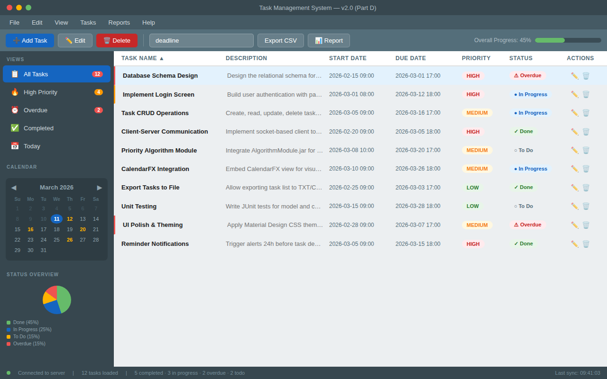
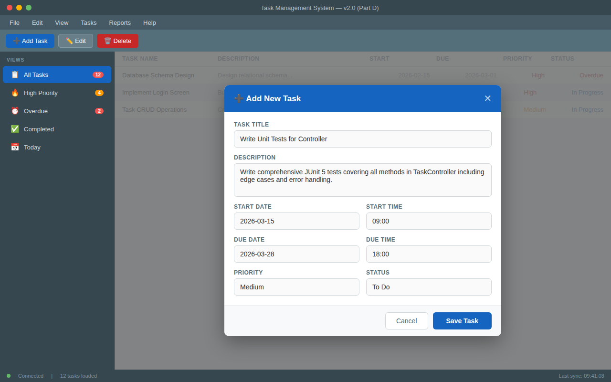

# Task Management System

A client/server task management application built with Java and JavaFX, developed as a 4-part academic project.

## Screenshots

| Main Task List | Add Task Dialog |
|---|---|
|  |  |

## Description

This system enables users to manage tasks through a graphical JavaFX interface connected to a backend server. The project is structured as four progressive parts (A–D), each adding new functionality on top of the previous one.

## Features

- **Task creation** — create tasks with title, description, start/end dates, priority, and status
- **Task editing and deletion** — modify or remove existing tasks
- **Calendar view** — view tasks on a CalendarFX calendar by due date
- **Sorting algorithms** — sort tasks by date, priority, or status using a generic sorting module
- **Search** — find tasks based on configurable criteria
- **Reminders** — automatic reminders for upcoming task deadlines
- **Client-server architecture** — client communicates with server via sockets using JSON (GSON)

## Tech Stack

- **Java** 17+
- **JavaFX** — graphical user interface
- **Maven** — build and dependency management
- **JUnit** — unit tests
- **CalendarFX** — calendar view component
- **GSON** — JSON serialization/deserialization
- **Client-server sockets** — network communication between client and server

## Project Structure

Source code is contained in ZIP archives for each part:

| Archive | Description |
|---|---|
| `TaskManagementSystemPartA.zip` | Part A — core data structures and algorithm module |
| `TaskManagementSystemPartB.zip` | Part B — file persistence and sorting/search algorithms |
| `TaskManagementSystemPartC.zip` | Part C — client-server architecture with socket communication |
| `TaskManagementSystemPartD.zip` | Part D — JavaFX GUI, calendar view, and full integration |

## How to Extract and Build

1. Extract the desired part:
   ```bash
   unzip TaskManagementSystemPartX.zip -d PartX
   cd PartX
   ```

2. Build with Maven:
   ```bash
   mvn clean install
   ```

3. Run tests:
   ```bash
   mvn test
   ```

4. For parts with a JavaFX client, ensure JavaFX is on the module path:
   ```bash
   mvn javafx:run
   ```

## Architecture

```
 +-------------------+       +-------------------+
 |     Client        |       |     Server        |
 +-------------------+       +-------------------+
 |  TaskController   | <---->|   TaskService     |
 |  TaskModel        |       |   SortingAlgorithm|
 +-------------------+       +-------------------+
        |                            |
        V                            V
 +-------------------+       +-------------------+
 |    GUI (JavaFX)   |       |  Database (File)  |
 +-------------------+       +-------------------+
```

## Academic Context

Submitted by **Hila Mendelson** and **Sahar Halili** as a collaborative academic project.

---

## 🇮🇱 תיעוד בעברית

### מה הפרויקט עושה

מערכת לניהול משימות המורכבת מלקוח ושרת, בנויה עם Java ו-JavaFX. המשתמש יכול ליצור, לערוך ולמחוק משימות, לצפות בהן על גבי לוח שנה, לחפש לפי קריטריונים שונים ולקבל תזכורות אוטומטיות לפני מועד היעד. התקשורת בין הלקוח לשרת מתבצעת דרך סוקטים עם העברת נתונים בפורמט JSON.

הפרויקט פותח כפרויקט אקדמי ב-4 חלקים עוקבים (א–ד), כאשר כל חלק מוסיף פונקציונליות על גבי הקודם — מהמודלים הבסיסיים, דרך אלגוריתמי מיון וחיפוש, ועד לממשק גרפי מלא עם ארכיטקטורת לקוח-שרת.

### טכנולוגיות

- **Java 17+** — שפת הפיתוח הראשית
- **JavaFX** — ממשק משתמש גרפי
- **Maven** — בניה וניהול תלויות
- **JUnit** — בדיקות יחידה
- **CalendarFX** — רכיב תצוגת לוח שנה
- **GSON** — סריאליזציה ודה-סריאליזציה של JSON
- **סוקטים** — תקשורת רשת בין לקוח לשרת

### הוראות התקנה והפעלה

1. חלצו את הארכיון של החלק הרצוי:
   ```bash
   unzip TaskManagementSystemPartX.zip -d PartX
   cd PartX
   ```

2. בנו את הפרויקט עם Maven:
   ```bash
   mvn clean install
   ```

3. הרצו את הבדיקות:
   ```bash
   mvn test
   ```

4. להפעלת הממשק הגרפי (בחלקים עם JavaFX):
   ```bash
   mvn javafx:run
   ```

### מבנה הפרויקט

קוד המקור מאורגן בארכיוני ZIP לפי חלקים:

| ארכיון | תיאור |
|---|---|
| `TaskManagementSystemPartA.zip` | חלק א — מבני נתונים ומודול אלגוריתמים |
| `TaskManagementSystemPartB.zip` | חלק ב — שמירה לקבצים, מיון וחיפוש |
| `TaskManagementSystemPartC.zip` | חלק ג — ארכיטקטורת לקוח-שרת עם סוקטים |
| `TaskManagementSystemPartD.zip` | חלק ד — ממשק JavaFX, תצוגת לוח שנה ואינטגרציה מלאה |
